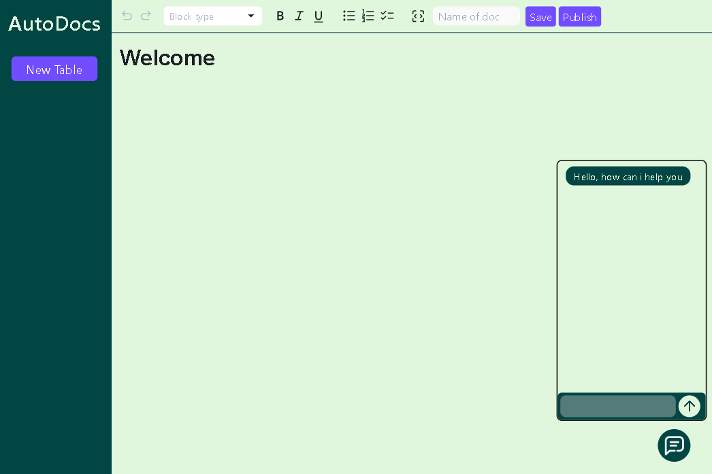

# AutoDocs

AutoDocs is a dynamic platform that allows users to create, style, and publish content to different platforms effortlessly. With its versatile markdown editor, AutoDocs is perfect for crafting blogs, personal notes, and more.

## Features

- **Dynamic Editor**: A powerful editor with extensive styling options, ideal for creating blogs or personal notes.
- **Code Block Support**: Easily include code snippets to enhance your technical content.
- **Multi-Platform Integration**: Supports popular blogging platforms like Medium, Hashnode, and Dev.to, allowing seamless publishing.
- **Gemini Integration**: Access a wealth of research and help resources directly from the platform.
- **Clean and User-Friendly UI**: An intuitive interface that simplifies the writing and publishing process.

## Tech Stack

       
